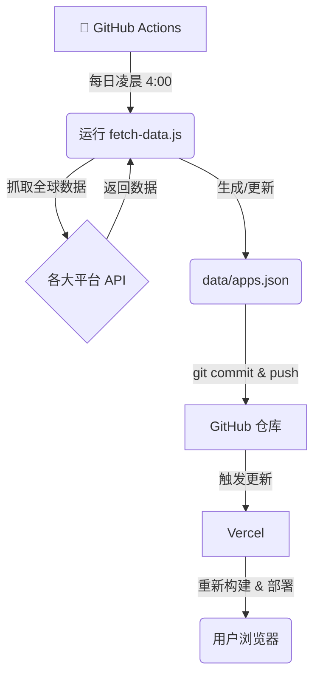

# Antigravity 全球应用展示

这是一个自动聚合全球 Antigravity 应用案例的展示网页。数据来自 GitHub, Reddit, Hacker News, Dev.to 等多个平台，每日更新。

## 📍 本地运行

1. **安装依赖** (首次运行需要)
   ```bash
   npm install
   ```
   (如果没有 `package.json`，可以直接用 `npx` 运行，如下)

2. **启动网页**
   ```bash
   npx serve .
   ```
   然后访问终端显示的地址 (通常是 `http://localhost:3000`)。

## 🔄 如何更新数据

数据存储在 `data/apps.json` 中。要获取全球最新数据：

### 方法 A: 使用脚本 (推荐)
在终端运行：
```bash
./update_data.sh
```

### 方法 B: 手动运行
```bash
node scripts/fetch-data.js
```
脚本会自动抓取 GitHub/Dev.to/HN 等最新内容，自动分类并翻译为中文，最后更新 `data/apps.json`。刷新网页即可看到新内容。

## 🌐 如何发布到网上

本项目是纯静态网页 (HTML/CSS/JS)，您可以免费托管到以下平台，**无需租用服务器**：

### 方案 1: Vercel (最简单、速度快)
1. 注册 [Vercel](https://vercel.com/) 账号。
2. 安装工具: `npm i -g vercel`
3. 在项目文件夹运行: `vercel`
4. 一路回车，您将获得一个类似 `https://antigravity-showcase.vercel.app` 的永久免费网址。

### 方案 2: GitHub Pages (完全免费)
1. 在 GitHub 上创建一个新仓库。
2. 将本项目代码上传 (Push) 到该仓库。
3. 在仓库 **Settings** -> **Pages** 中，将 Source 设为 `main` 分支 (或其他分支)。
4. Save 后，GitHub 会自动生成网址。

---

## 🛠️ 项目架构原理

本项目是一个典型的 **Serverless (无服务器)** 静态网站架构：



- **后端 (数据层)**: 没有传统的后台服务器。使用 **GitHub Actions** 作为计算资源，每日定时运行脚本抓取数据，并保存为 `json` 文件。
- **前端 (展示层)**: 纯 HTML/JS 静态页面，托管在 **Vercel** CDN 上。
- **连接**: 数据直接存储在代码仓库中。通过 git 提交触发 Vercel 的自动化部署。

## 🤝 开源说明

本项目默认是 **开源 (Open Source)** 的。
- 任何人都可以查看源码。
- 任何人都可以 `Fork` (复制) 一份作为模板，修改成展示其他内容的网站（比如 "AI 绘画工具收集"）。
- `README.md` 文档是由开发者编写的，帮助其他人理解项目。

---
**提示**: 本项目已配置 **GitHub Actions** (`.github/workflows/update_data.yml`)。
只要您将代码推送到 GitHub，系统就会在每天 **北京时间凌晨 4:00** 自动运行采集脚本，并将最新数据提交回仓库。
（如果您连接了 Vercel，数据更新后 Vercel 也会自动重新部署，实现全自动更新！）
